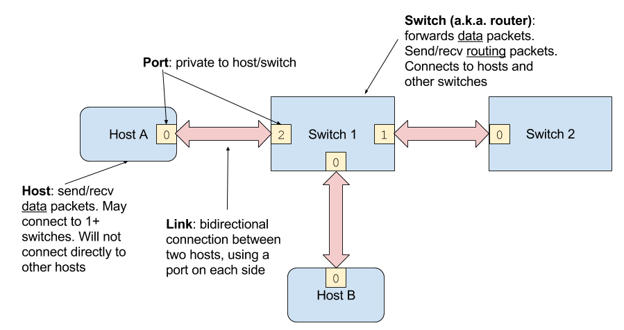

# Frequently Asked Questions

### What is a port vs a link vs a switch/router vs a host?



### How will our code be tested?

We will put your routers through a variety of scenarios like the test cases included with the project. These scenarios will involve different topologies, topology changes, and link failures, and your routers will be graded on how well they deliver packets, adapt to changes, and conform to the requirements. These tests will be more extensive than the tests included with the project in `tests/`, and passing those tests is no guarantee that your code will pass all of our tests.

### Does our code have to be optimized?

No, you don't need to worry about your code's resource usage as long as it completes within a reasonable time limit. However, do avoid sending excessive routing updates.

### What should we do if a path expires but a higher-cost alternative exists? 

You may either switch over to it immediately, or drop packets to the affected destination until you receive another advertisement for the higher-cost alternative.
Direct routes to hosts should always be used as backup routes in case an indirect route expires.
We will not test that you maintain backup indirect routes to a host.

### What should we do if there are two equal-cost paths and one expires?

Don't begin dropping packets in this case. Instead, either switch over immediately to the other path, or always break ties between paths by using the freshest available path.

### What's the difference between split horizon and poison reverse? 

Split horizon (aka "simple split horizon") and poison reverse (aka "split horizon with poisoned reverse") are two different ways of doing the same thing (avoiding count-to-infinity in some cases). They differ in (1) how they encode reverse routes, (2) what that means for routing message sizes, and (3) what that means for support for incremental updates.

(1) Split horizon encodes reverse routes through omission: every routing message includes the whole routing table, minus the reverse routes. Poison reverse encodes reverse routes explicitly, by marking them with infinite cost.

(2) If you manage a small network connected to a much bigger network, split horizon will result in smaller routing messages, because you only have to send one route entry per host for the few hosts you own. On the other hand, poison reverse makes you send updates with one route entry for each of the hosts you know about, anywhere.

(3) Because split horizon encodes reverse routes through omission, you can't send an incremental update. If you want to withdraw one route, you have to send a full normal routing update minus that one entry. On the other hand, with poison reverse you can send a small routing update with just that one route, advertising it as having infinite cost.

Note that neither (2) nor (3) are important for this project, because you don't need to care about sending very few routing messages, and you don't need to perform incremental (triggered) updates.

### What should we do if the best route to a destination increases in cost? 

If a neighbor tells you its route to a destination has increased in cost, you must trust them and update your routing table immediately. Not doing so will break all kinds of things until the bad route times out, including fallback to better paths, as well as loop avoidance in case they are now using you as their next hop and are performing poison reverse.

This highlights a common pitfall: only ever replacing a route with a lower-cost route, even when the source of the route update is authoritative regarding the cost increase.

### What is the purpose of HostDiscoveryPackets, and how are they different from handle\_link\_up? 

handle\_link\_up tells you that you have a new link, which port it's connected to, and what its latency is. It doesn't tell you anything about what's on the other side of the link.

A HostDiscoveryPacket tells you that if you send out of that port, you'll reach a host that can be identified using the address in packet.src. If it weren't for HostDiscoveryPackets, you wouldn't know how to refer to a host.

### Can a host be connected to multiple routers? 

Yes.

The default host type will send one packet to each connected router. Ideally a host would choose the best gateway, but these ones don't. Our tests will be aware of this, of course.

### Should direct routes to hosts expire? 

No, don't expire routes based on HostDiscoveryPackets, because these packets will not be resent.

### Do we need to remember a direct route to a host even if there is a shorter indirect route? 

Yes.

The principle is that after any failure, your routing algorithm should eventually be able to re-establish connectivity between any two nodes that actually are connected.

In this case, if the shorter indirect route fails, you should eventually fall back to the direct route. This means you have to remember direct routes to hosts, even if they aren't the best route.

### What is an example of count-to-infinity?

Consider the following topology, where unlabeled edges have cost 1. Suppose poison mode is on. We'll fail the a-b link and walk through the sequence of events.

```
    H
    |
    a
    |
    b
   / \ 1.5
  c - d
```

1. Initially c can reach H via b for cost 3.
2. When the a-b link fails, b sends poison to c and d.
3. The order of events is such that c accepts the poison, but then receives an advertisement from d for its old path of cost 3.5. Therefore c now thinks it can reach H via d for cost 4.5.
4. c advertises this route to b, so b now thinks it can reach H via c for cost 5.5.
5. b advertises this route to d, so d now thinks it can reach H via b for cost 7.
6. d advertises this route to c, so c now thinks it can reach H via d for cost 8.
7. c advertises this route to b, so b now thinks it can reach H via c for cost 9.
8. b advertises this route to d, so d now thinks it can reach H via b for cost 10.5.
9. d advertises this route to c, so c now thinks it can reach H via d for cost 11.5.
10. c advertises this route to b, so b now thinks it can reach H via c for cost 12.5.
11. b advertises this route to d, so d now thinks it can reach H via b for cost 14.
12. d advertises this route to c, so c now thinks it can reach H via d for cost 15.
13. c advertises this route to b. The cost for b to reach H via c is now 16, so b knows it has no route to H. This breaks the cycle.
